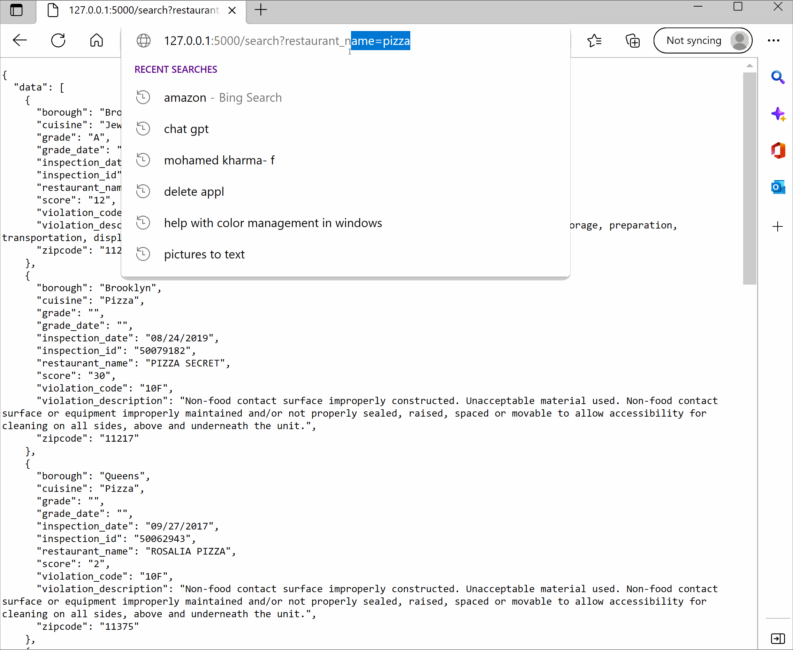

# Restaurant Inspection API Part I

The New York City Department of Health and Mental Hygiene (DOHMH) has publicized Restaurant Inspection Results. You can find the restaurant inspection results [here](https://data.cityofnewyork.us/Health/DOHMH-New-York-City-Restaurant-Inspection-Results/43nn-pn8j).

Unfortunately, there is no great way for engineers to search or consume the data programmatically. As a result, we want to create an API that allows other engineers to search Restaurant Inspection Results.

Given the interest in an API, some engineers have proposed the routes they would like to send a request to and the data they would like to receive.

Engineers are conscious that you are all students and, as such, have requested a light pilot that meets their requirements. Below you will find the routes that are of most interest to them at this time.

## Routes:
`GET /search`

At this time, engineers would like to exclusively search by sending a `GET` request to the `/search` route as detailed above.

The engineers would like to search the date by using the following filters:
* Cuisine
* Restaurant Name
* Zip Code

Clients would like the `Zip Code` filter to be case-insensitive and return exact matches.

Clients would like the `Cuisine` and `Restaurant Name` filters to be case-insensitive and include partial matches.

The clients will provide their filtering details in the URL in the form of query parameters. The expectation is that clients can search for inspections by any combination of the filters mentioned thus far.

For example, a client can search by:
* `Restaurant Name`
* `Cuisine` & `Zip Code`

Below you will find several examples of requests that clients might make:
  - `curl --location --request GET 'http://127.0.0.1:5000/search?restaurant_name=pizza'`
    - [Example response](golden_files/search_by_restaurant_name.json)
  - `curl --location --request GET 'http://127.0.0.1:5000/search?zipcode=10031'`
    - [Example response](golden_files/search_by_zipcode.json)
  - `curl --location --request GET 'http://127.0.0.1:5000/search?cuisine=italian&limit=5'`
    - [Example response](golden_files/search_by_cusine_with_limit.json)
  - `curl --location --request GET 'http://127.0.0.1:5000/search?cuisine=mexican&zipcode=10003`
    - [Example response](golden_files/search_by_cusine_and_zipcode.json)
  - `curl --location --request GET 'http://127.0.0.1:5000/search?restaurant_name=taco&cuisine=mexican&zipcode=10003'`
    - [Example response](golden_files/search_by_restaurant_name_cusine_and_zipcode.json)

Engineers are expecting the API response to be the following shape:
```JSON
{
   "data" : [
      {
         "inspection_date" : "10/30/2019",
         "grade" : "B",
         "restaurant_name" : "TAQUERIA DIANA",
         "violation_code" : "06C",
         "zipcode" : "10003",
         "borough" : "Manhattan",
         "restaurant_id" : "50002648",
         "grade_date" : "10/30/2019",
         "violation_description" : "Food not protected from potential source of contamination during storage, preparation, transportation, display or service.",
         "score" : "27",
         "cusine" : "Mexican"
      },
      ...
   ]
}
```

If you are up for it, the ask is to create an API endpoint that meets the qualifications mentioned above. Boilerplate code has been shared with you and can be found here. There are several files worth highlighting:
  - [data.csv](data.csv) --> Subset of inspection data that we are using.
  - [inspector.py](inspector.py) --> The `Inspector` is responsible for retrieving inspections, which is made possible by calling `Inspector.get_inspections()`.
  - [inspection.py](inspection.py) --> The `Inspection` class, which represents a restaurant inspection and includes helper methods that should help form the API response.
  - [app.py](app.py) --> The file in which you will write out your API endpoint. Make sure only to submit this file in BlackBoard.

**Please make sure only to submit the app.py file via Blackboard.**

Things to keep in mind:
  - There is no need to sanitize nor validate the query parameter values in the URL. We are taking a leap of faith and trusting the values provided to us.
  - The default results limit is ten (10) unless specified by the client. Unless the client provides a limit via a query parameter (`?limit=25`), you are to return up to 10 results.
  - Clients can choose to provide one filter or many. Your solution should be able to accommodate any combination.


